# Architecture Diagrams and Visual Guides

This document provides a complete visual reference for the Heirloom-Protocol system. All diagrams use [Mermaid](https://mermaid.js.org/) syntax and render natively in GitHub, GitLab, VS Code (with the Markdown Preview Mermaid Support extension), and most modern documentation platforms.

## Table of Contents

- [Diagram Conventions](#diagram-conventions)
- [Component Diagram](#component-diagram)
- [Data Flow Diagrams](#data-flow-diagrams)
  - [Check-In Flow](#check-in-flow)
  - [Vault Release Flow](#vault-release-flow)
  - [Withdrawal Flow](#withdrawal-flow)
  - [Deployment Flow](#deployment-flow)
- [Sequence Diagrams](#sequence-diagrams)
  - [Vault Creation and Funding](#vault-creation-and-funding)
  - [Owner Check-In](#owner-check-in)
  - [Beneficiary Release](#beneficiary-release)
  - [Passkey Registration and Biometric Check-In](#passkey-registration-and-biometric-check-in)
  - [Vault Hibernation](#vault-hibernation)
  - [TTL Borrowing](#ttl-borrowing)
  - [Beneficiary Conflict Resolution](#beneficiary-conflict-resolution)
  - [Vault Archival and Restoration](#vault-archival-and-restoration)
- [State Diagrams](#state-diagrams)
  - [Vault Lifecycle States](#vault-lifecycle-states)
  - [Passkey States](#passkey-states)
  - [Beneficiary Acceptance States](#beneficiary-acceptance-states)
- [Entity Relationship Diagram](#entity-relationship-diagram)
- [Technology Stack](#technology-stack)
- [Related Documentation](#related-documentation)

---

## Diagram Conventions

| Convention | Meaning |
|---|---|
| Solid arrows (`-->`) | Synchronous call or data flow |
| Dashed arrows (`-.->`) | Asynchronous call, event, or optional path |
| `[[ ]]` nodes | Database or persistent storage |
| `(( ))` nodes | External actor or system |
| `{ }` nodes | Decision point |
| Bold border nodes | Entry points (user-facing) |
| Green fill | Success / happy path |
| Red fill | Error / failure path |
| Orange fill | Warning / conditional path |

All diagrams show testnet/mainnet production flows. Local development (Docker Quickstart) follows the same logical flow with `localhost` endpoints replacing remote URLs.

---

## Component Diagram

The following diagram shows all major components and their communication channels.

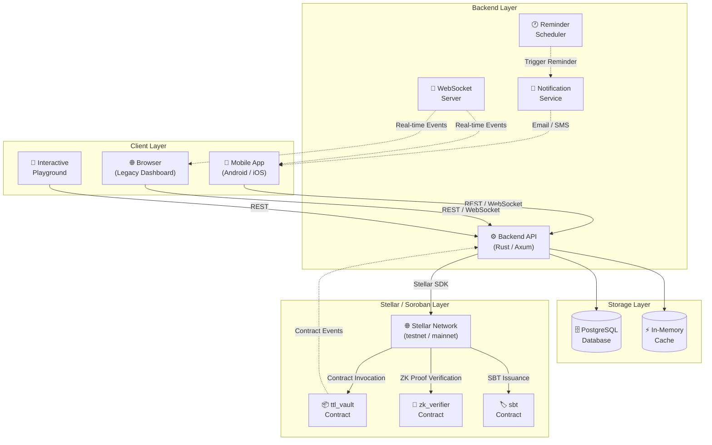

---

## Data Flow Diagrams

### Check-In Flow

This flow shows how a vault owner proves liveness to extend TTL.

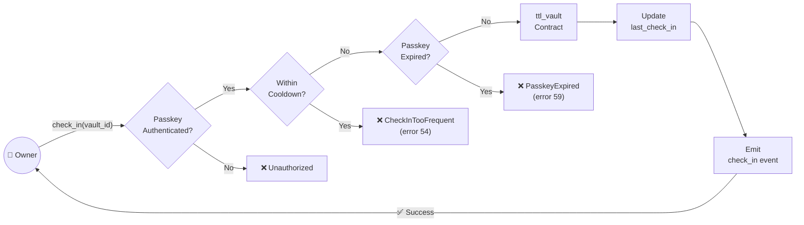

### Vault Release Flow

This flow shows how funds are transferred to the beneficiary when TTL expires.

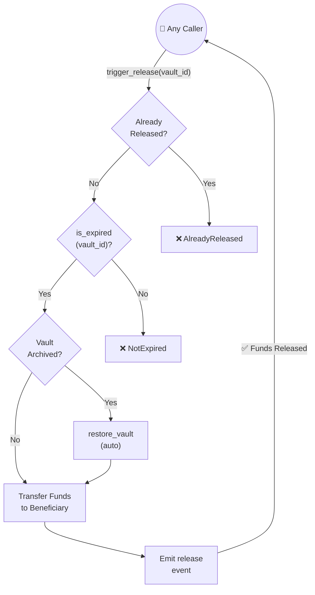

### Withdrawal Flow

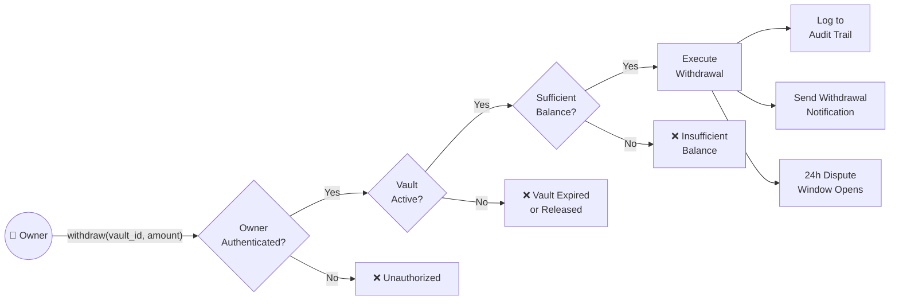

### Deployment Flow

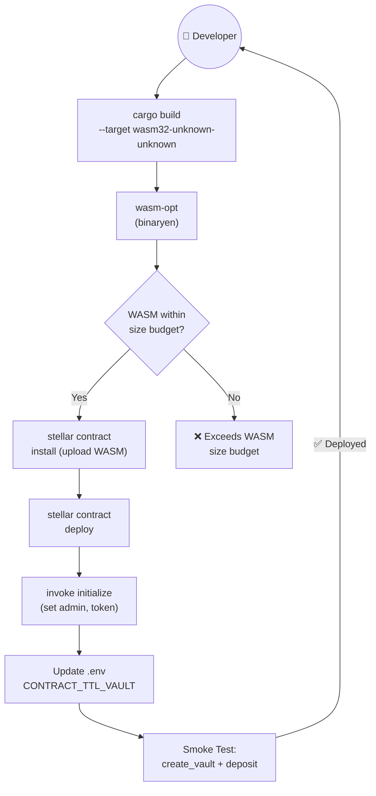

---

## Sequence Diagrams

### Vault Creation and Funding

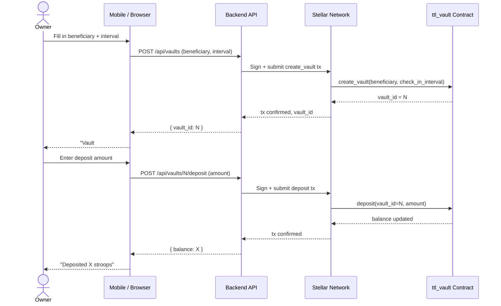

### Owner Check-In

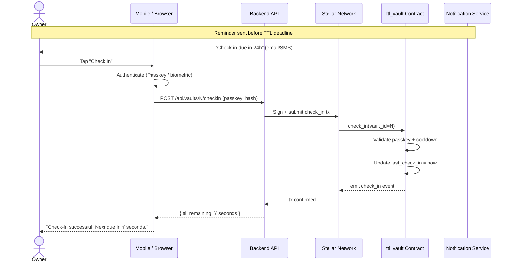

### Beneficiary Release

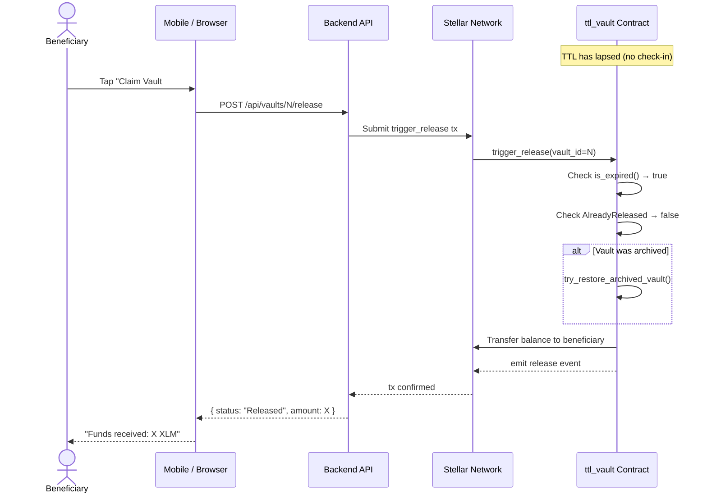

### Passkey Registration and Biometric Check-In

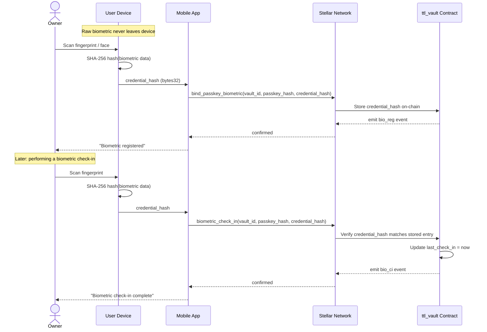

### Vault Hibernation

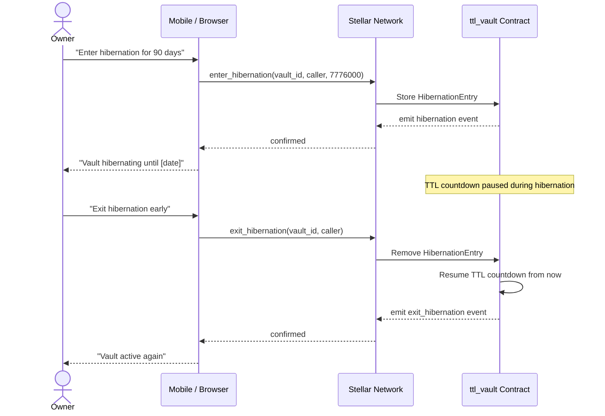

### TTL Borrowing

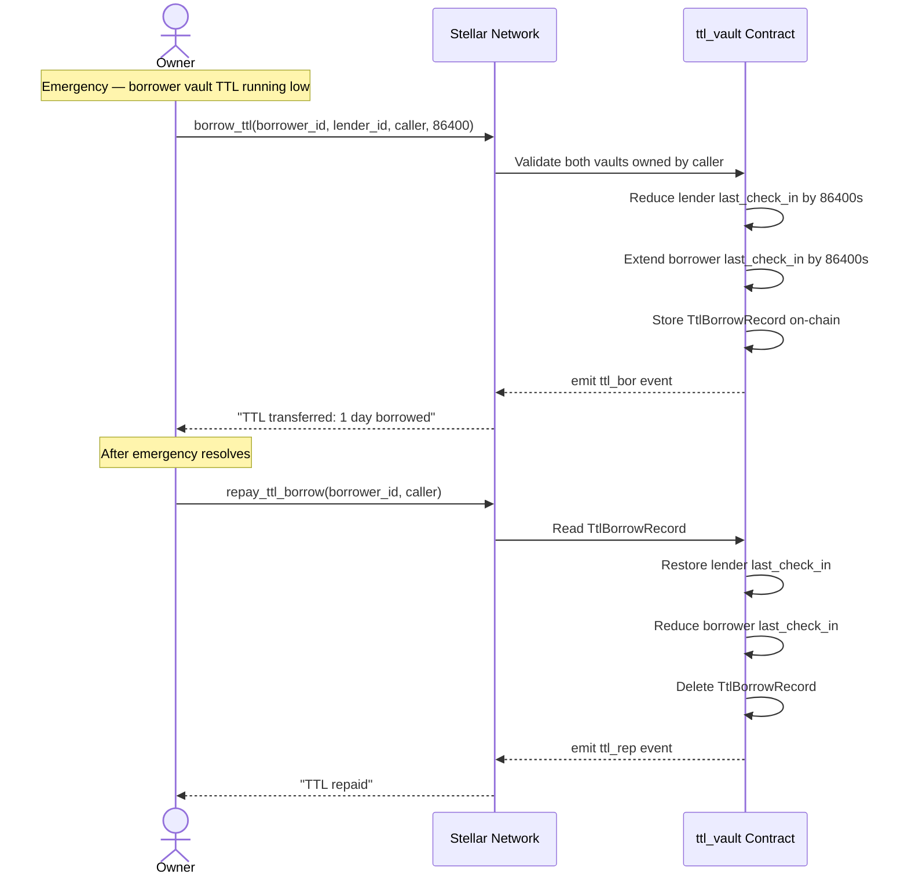

### Beneficiary Conflict Resolution

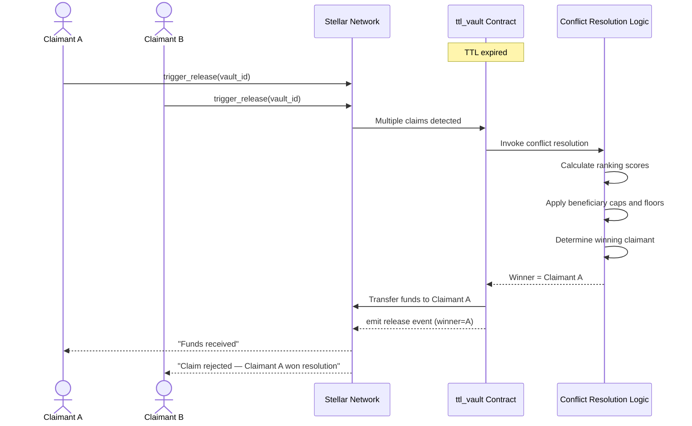

### Vault Archival and Restoration

```mermaid
sequenceDiagram
    participant Time as Soroban Network
    participant Vault as ttl_vault Contract
    participant OffChain as Off-chain Indexer
    participant Caller as Any Caller

    Note over Time: Owner inactive — no deposits, withdrawals, check-ins

    Time->>Vault: Persistent storage TTL reaches zero
    Vault->>Vault: State archived (not deleted)
    OffChain->>Vault: Detect archival; snapshot state
    OffChain->>Vault: Store ArchivedVaultInfo(vault_id)

    Note over Caller: Beneficiary wants to trigger release

    Caller->>Vault: trigger_release(vault_id)
    Vault->>Vault: try_restore_archived_vault()
    Vault->>Vault: Extend persistent entry TTL
    Vault->>Vault: Remove ArchivedVaultInfo snapshot
    Vault->>Vault: is_expired() → true
    Vault->>Stellar: Transfer funds to beneficiary
    Vault-->>Caller: emit release + v_restore events
```

---

## State Diagrams

### Vault Lifecycle States

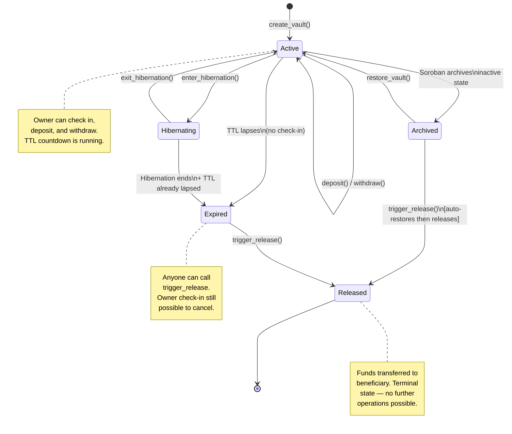

### Passkey States

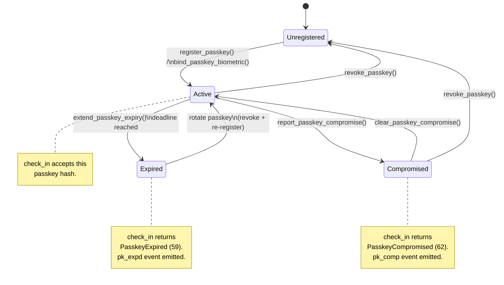

### Beneficiary Acceptance States

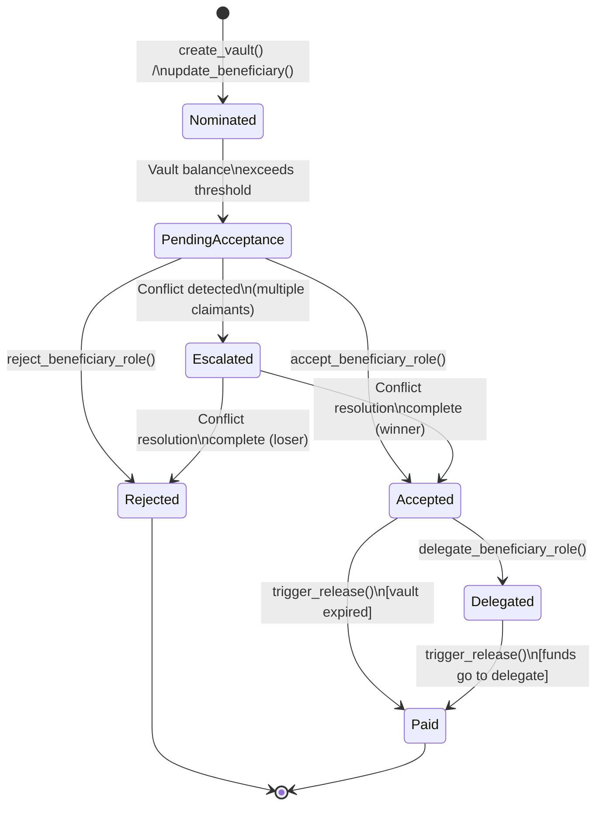

---

## Entity Relationship Diagram

This diagram shows the key on-chain data entities and their relationships.

```mermaid
erDiagram
    VAULT {
        u64 vault_id PK
        Address owner
        Address beneficiary
        i128 balance
        u64 last_check_in
        u64 check_in_interval
        bool is_released
        bool is_paused
    }

    PASSKEY {
        u64 vault_id FK
        BytesN32 passkey_hash PK
        u64 expiry
        bool is_compromised
    }

    BIOMETRIC_ENTRY {
        u64 vault_id FK
        BytesN32 passkey_hash FK
        BytesN32 credential_hash PK
    }

    HIBERNATION_ENTRY {
        u64 vault_id PK_FK
        u64 start_time
        u64 duration_seconds
        Address initiated_by
    }

    TTL_BORROW_RECORD {
        u64 borrower_vault_id PK_FK
        u64 lender_vault_id FK
        u64 borrow_seconds
        u64 borrow_timestamp
    }

    GEO_CHECK_IN_ENTRY {
        u64 vault_id FK
        u64 timestamp
        i64 latitude_micro
        i64 longitude_micro
        String country_code
    }

    ARCHIVED_VAULT_INFO {
        u64 vault_id PK_FK
        u64 archived_at
        i128 balance_at_archive
    }

    VAULT ||--o{ PASSKEY : "has"
    PASSKEY ||--o{ BIOMETRIC_ENTRY : "has"
    VAULT ||--o| HIBERNATION_ENTRY : "may have"
    VAULT ||--o| TTL_BORROW_RECORD : "may have (as borrower)"
    VAULT ||--o{ GEO_CHECK_IN_ENTRY : "logs"
    VAULT ||--o| ARCHIVED_VAULT_INFO : "may have"
```

---

## Technology Stack

| Component | Technology | Rationale |
|---|---|---|
| **Smart Contracts** | Rust / Soroban | Secure, performant, and native to Stellar |
| **Backend API** | Rust / Axum | Type-safe, high-concurrency, efficient performance |
| **Database** | PostgreSQL | Reliable relational storage for off-chain backend state |
| **Mobile (Android)** | Kotlin / Jetpack Compose | Native performance and UI |
| **Mobile (iOS)** | Swift / SwiftUI | Native performance and UI |
| **Blockchain** | Stellar | Low cost, fast finality, robust smart contract platform |
| **Auth** | Passkeys / WebAuthn | Phishing-resistant, no seed phrase exposure |
| **ZK Proofs** | `zk_verifier` contract | On-chain passkey signature verification |
| **Soulbound Tokens** | `sbt` contract | Non-transferable identity and reputation tokens |
| **Notifications** | Email + SMS (configurable APIs) | Owner reminders for upcoming check-in deadlines |
| **Monitoring** | Prometheus-compatible metrics | Service health and contract event tracking |
| **CI** | GitHub Actions | Automated build, test, and lint on every PR |

---

## Related Documentation

- [docs/ttl-logic.md](ttl-logic.md) — detailed TTL and state archival mechanics
- [docs/passkeys.md](passkeys.md) — passkey and biometric authentication
- [docs/beneficiary-conflict-resolution.md](beneficiary-conflict-resolution.md) — conflict resolution algorithm
- [docs/hibernation.md](hibernation.md) — vault hibernation feature
- [docs/withdrawal-features.md](withdrawal-features.md) — withdrawal lifecycle and dispute
- [docs/security.md](security.md) — threat model and security properties
- [docs/zk-verifier.md](zk-verifier.md) — ZK verifier contract details
- [docs/sbt.md](sbt.md) — Soulbound Token contract details
- [docs/deployment-guide.md](deployment-guide.md) — end-to-end deployment guide
- [docs/faq.md](faq.md) — frequently asked questions
- [docs/playground.md](playground.md) — interactive playground for hands-on exploration
